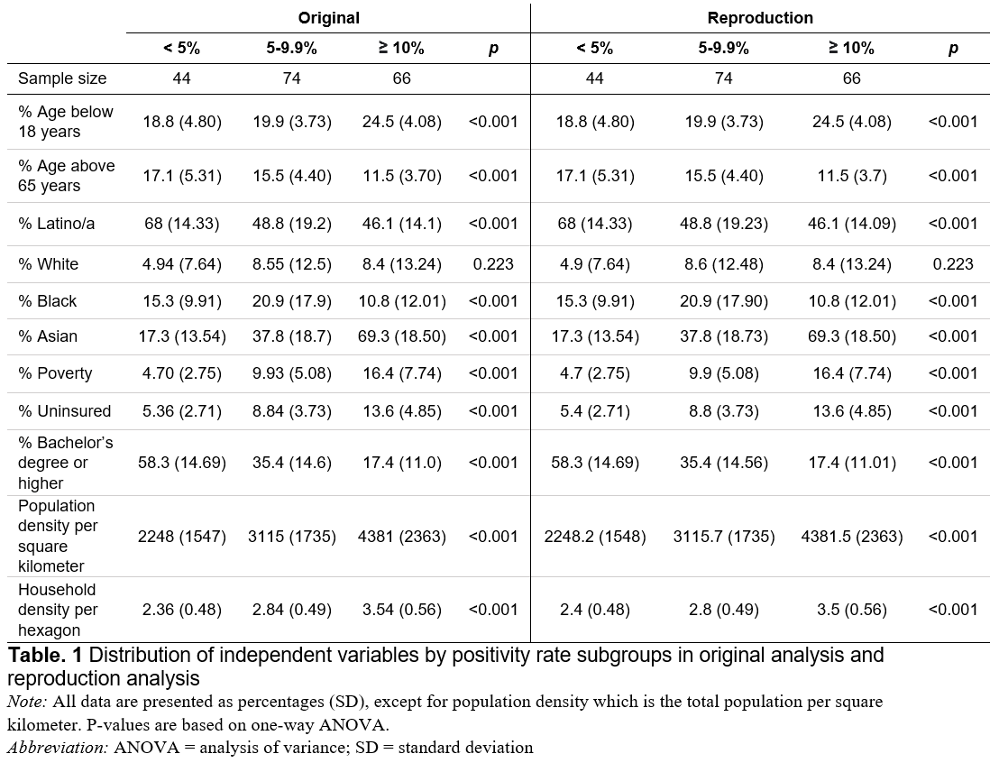
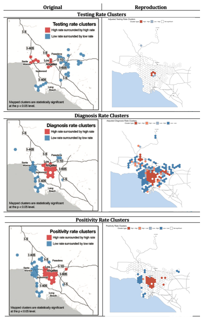
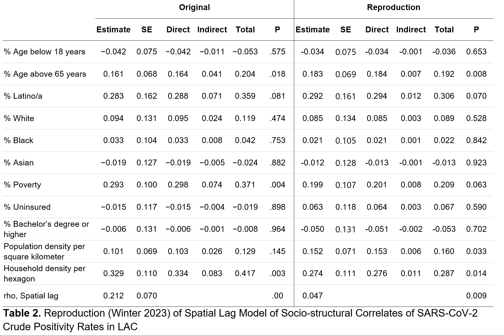
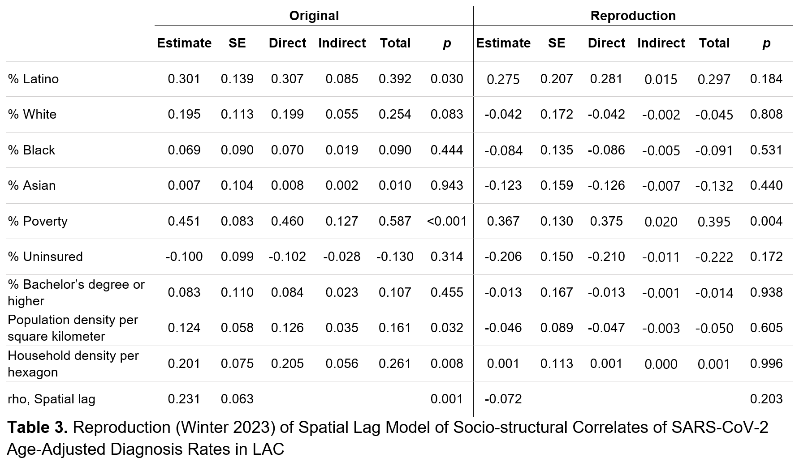
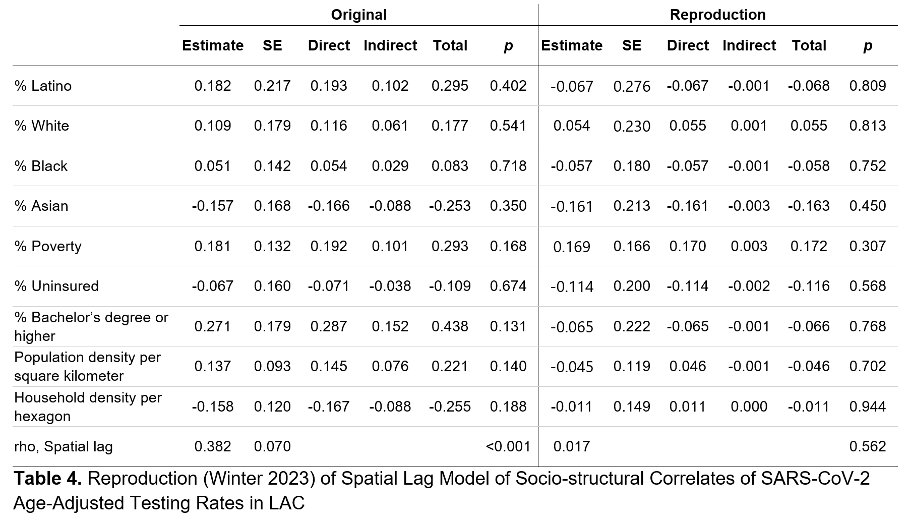

## Original Study Design

Vijayan et al. (2020) examined whether spatial patterns existed in SARS-CoV-2 age-adjusted testing rates, age-adjusted diagnosis rates, and crude positivity rates in Los Angeles County (LAC), and used a spatial regression model to explore associations between COVID-19 crude positivity rates and a series of predictor variables. The original analyses are retrospective and use observational data collected from federal and private sources. Although not publicly available, we were able to obtain the original study data after contacting the authors. However, the analysis code was not made available, nor was information about the computational environment used. Prior to analysis, the data were reapportioned to a hexagonal grid created by the authors. However, the authors provided limited details about how the hexagonal grid was generated. The authors did not provide any details about the algorithm or parameters used to create the grid. Each hexagon in the grid encompassed an area of 10 square kilometers. Once created, the grid was overlaid onto the centroids of city, community, and census tract boundaries within LAC, and all data were summarized and joined to the hexagon layer by location. Hexagons that either contained missing COVID-19 data, had a population of less than 1,000 people, or did not have contiguous neighbors were excluded from the analysis. The final analysis sample contained 184 hexagons. We found that in the original study's hexagon grid, many adjacent hexagons have gaps between them or have overlap with each other, affecting the result of spatial regression. Hence, we decided to create a new hexagon grid that fixed the connectivity problem of the hexagon grid in the original study.

Here are the three research hypotheses to reproduce.

-   **H1**: There is a difference in mean values of key socioeconomic and demographic variables
    by positivity rate groupings of low, medium, and high areas.

-   **H2**: (a) COVID-19 age-adjusted testing rate, (b) age-adjusted diagnosis rate, and (c) crude positivity rate were non-randomly distributed throughout LAC

-   **H3**: Socio-structural characteristics of LAC have non-zero association with crude positivity rate.

## Alternate Study Design

Vijayan et al. (2020) did not specify the computational environment or software used during their original study. In the absence of this information, we decided to implement these analyses in R v4.0.5 and Rstudio v1.4.1106 using the following packages: tidyverse, sp, rgdal, spatialreg, spdep. Although Vijayan et al. described using a permutation approach for identifying statistically significant clusters in their LISA analyses, they did not detail the number of simulations conducted, nor did they indicate how statistical significance was calculated for the SLM models. We elected to implement a permutation approach which used 499 simulations in order to calculate our p-values. Because there is inherent randomness in the permutation approach, when a seed is not set, and we cannot be certain of the number of simulations performed, we did not expect to be able to fully reproduce the exact p-values reported in the paper, however we expected that the direction and magnitude of the results would be consistent between the original analysis and the reproductions.\
We decided to recreate the hexagonal grid so that it would not produce gaps between the hexagons. We will use Vijayan et al.'s centroids to generate new hexagons that have the same size as the original study's hexagons. Then, we assign the values of the old hexagons to the new hexagons by in joining the new hexagons with the centroids of the old hexagons based on their locations. Furthermore, we will clarify the variables death rate, case rate, and diagnosis rate as they are unclearly defined in the study. This and the change in the hexagonal grid would generate different tables, results we will explore in our discussion.

```{r setup, include=FALSE}
knitr::opts_chunk$set(echo = TRUE)

# script to install packages if not already installed
packages = c("sf", "tidyverse", "ggplot2", "here", "spdep", "rgdal", "spatialreg", "car", "ggplot2", "dplyr")
setdiff(packages, rownames(installed.packages()))
install.packages(setdiff(packages, rownames(installed.packages())), quietly=TRUE)

#rm(list=ls())
#set.seed(59134)

library(sf)
library(tidyverse)
library(ggplot2)
library(here)
library(spdep)
#library(rgdal)
library(spatialreg)
library(car)
library(ggmap)
library(dplyr)


#library("groundhog")
#pkgs <- c("sf","tidyverse", "ggplot2", "here", "spdep", "spatialreg", "car", "ggmap", "dplyr", "rmarkdown", #"knitrOK")
#groundhog.library(pkgs, "2023-09-01")

```

## Data preprocessing

#### *Planned Differences from the Original Study:*

We found that in the original study's hexagon grid, many adjacent hexagons have gaps between them or have overlap with each other, affecting the result of spatial regression. Hence, we decided to create a new hexagon grid that fixed the connectivity problem of the hexagon grid in the original study.

By changing the hexagon, we found that there are three hexagons whose entries `age18` and `age65` are null, which later impedes the SAR model from running. Since we are not able to access the original census data used by the study and re-aggregate it to the hexagon grid, we decide to impute the data by assigning the medium value of the columns of `age18` and `age65` to the blank data.

```{r read data}
#-- Read in data file --#
ds_orig <- read_sf(here("data", "raw", "private", "LAhex_ACS_2023_1.shp"))

#-- Filter to analysis sample --#
ds_restricted <- ds_orig %>% 
                        filter(DP05_0001E >= 1000 & !is.na(tested630_) & !is.na(crt630_mea)) %>%
                        rename(age18     = DP05_0019P, 
                               age65     = DP05_0024P,
                               latino    = DP05_0071P, 
                               white     = DP05_0037P,
                               black     = DP05_0038P, 
                               asian     = DP05_0044P,
                               poverty   = DP03_0119P, 
                               uninsured = DP03_0099P,
                               bachelor  = DP02_0067P, 
                               pop.tot   = DP05_0001E,
                               hh_tot    = DP05_0086E,
                               tests     = tested630_,
                               cases     = cases630_s,
                               fid       = fid, 
                               area      = areasqkm, 
                               adjdrt    = adjcrt630_, # diagnosis data should be case data, not death data
                               adjtrt    = adjtrt630_,
                               westside  = Westside) %>%
                        mutate(pop.dens  = pop.tot/10,      # calculate population density
                               hh.dens   = pop.tot/hh_tot,  # calculate household density
                               prt       = 100*cases/tests, # calculate crude positivity rates
                               prt_level = 0)               # create variable to fill with values later 


# Added Imputation Step: we impute the values of two fields `age18` and `age65` using the median value of all the hexagon value. 
# There could be better ways to improve this. 
median_value18 <- median(ds_restricted$age18, na.rm = TRUE)
median_value65 <- median(ds_restricted$age65, na.rm = TRUE)
ds_restricted$age18[is.na(ds_restricted$age18)] <- median_value18
ds_restricted$age65[is.na(ds_restricted$age65)] <- median_value65

QN <- poly2nb(ds_restricted, queen = T) # queen neighbors for each polygon
cards <- card(QN) # number of neighbors for each hexagon
no.neighbor.id <- which(cards == 0) # row id for hexagons containing 0 neighbors
ds_analysis <- ds_restricted[-no.neighbor.id,]

```

## Descriptive characteristics of the data

### Correlates of test positivity

To reproduce summary statistics from Table 1 of original analysis, we first need to create a categorical variable based on the continuous positivity rate (prt). The variable prt_level divides observations into 3 mutually exclusive categories (\< 5%, 5% \< 10%, and 10% or greater). We then take the mean and standard deviation of key covariates to reproduce Table 1. We also performed one-way ANOVA tests to assess for differences in mean values across subgroups. Vijayan et al. noted in-text that they performed "correlational analysis" but based on the presentation of the findings, it appeared that either ANOVA or Kruskal-Wallis tests were used to assess differences across the 3 subgroups. Given that we were able to identically reproduce the reported p-value for the only non-significant result using ANOVA, we suspect that ANOVA was performed for all variables regardless of the underlying distribution.

```{r anova}
# divide hexagons into 3 groups according to the positivity rate
for (i in 1:nrow(ds_analysis)) {
  if (ds_analysis$prt[i] < 5) ds_analysis$prt_level[i] <- "Low"
  if (ds_analysis$prt[i] >= 5 & ds_analysis$prt[i] < 10) ds_analysis$prt_level[i] <- "Med"
  if (ds_analysis$prt[i] >= 10) ds_analysis$prt_level[i] <- "High"
}
table(ds_analysis$prt_level)

# generate the descriptive statistics of the independent variables
data.sum <- ds_analysis %>%
  group_by(factor(prt_level)) %>%
  summarise(no.hex = length(prt_level),
            age18 = paste0(round(mean(age18, na.rm = T),1)," ","(",round(sd(age18, na.rm = T),2),")"),
            age65 = paste0(round(mean(age65, na.rm = T),1)," ","(",round(sd(age65, na.rm = T),2),")"),
            white = paste0(round(mean(white, na.rm = T),1)," ","(",round(sd(white, na.rm = T),2),")"),
            black = paste0(round(mean(black, na.rm = T),1)," ","(",round(sd(black, na.rm = T),2),")"),
            asian = paste0(round(mean(asian, na.rm = T),1)," ","(",round(sd(asian, na.rm = T),2),")"),
            latino = paste0(round(mean(latino, na.rm = T),1)," ","(",round(sd(latino, na.rm = T),2),")" ),
            poverty = paste0(round(mean(poverty, na.rm = T),1)," ","(",round(sd(poverty, na.rm = T),2),")" ),
            uninsured = paste0(round(mean(uninsured, na.rm = T),1)," ","(",round(sd(uninsured, na.rm = T),2),")"),
            bachelor = paste0(round(mean(bachelor, na.rm = T),1)," ","(",round(sd(bachelor, na.rm = T),2),")"),
            pop.dens = paste0(round(mean(pop.dens, na.rm = T),1)," ","(",round(sd(pop.dens, na.rm = T),2),")"),
            hh.dens = paste0(round(mean(hh.dens, na.rm = T),1)," ","(",round(sd(hh.dens, na.rm = T),2),")"))

#----------------------------------------------------------------------#
#-- Compute the analysis of variance (ANOVA) and post-hoc Tukey test --#
#----------------------------------------------------------------------#

#- Create function to perform ANOVA, post-hoc tukey test, and checks for normality and homoscedasticity -#

anova_test <- function (p)  {
  count = 1   ## create counter
  
  #-- Create empty lists to hold needed elements in return list --#
  pval <- list()
  hov <- list()
  norm_test <- list()
  krusk_pval <- list()

  #-- Loop over each of the predictors, perform ANOVA, extract p-values --#
  for (p in predictors) {
  
    print(paste("--------- RUNNING ANOVA FOR", quo_name(p), "-------------"))
    
    res.aov <- aov(as.formula(paste(p, "~", "prt_level")), data = ds_analysis) 
    pval[[count]] <-  summary(res.aov)[[1]][1,5] ## store p-value from ANOVA to add to Table 1
    print(TukeyHSD(res.aov))  ## look at post-hoc Tukey test results

    #--Identify variables that fail ANOVA assumptions
    hov[[count]] <- leveneTest(as.formula(paste(p, "~", "prt_level")), data = ds_analysis)$"Pr(>F)"[1]  ## assess homogeneity of variances
    norm_test[[count]] <- shapiro.test(x = residuals(object = res.aov))$p.value  ## assess normality assumption

    
    print(paste("--------- RUNNING KRUSKAL-WALLIS FOR", quo_name(p), "-------------"))
    res.krusk <- kruskal.test(as.formula(paste(p, "~", "prt_level")), data = ds_analysis) 
    krusk_pval[[count]] <-  res.krusk$p.value ## store p-value from ANOVA to add to Table 1
    
        
    #--Create list of ANOVA results for reporting purposes
    aov_results <- (list("pvalue" = pval, "levene" = hov, "shapiro" = norm_test, "kruskal_pvalue" = krusk_pval))
    count = count + 1
  } 
  
  return(aov_results)
}

#- Define list of predictors and run ANOVA function -#
predictors <- c("age18",
                "age65",
                "white",
                "black",
                "asian",
                "latino",
                "poverty",
                "uninsured",
                "bachelor",
                "pop.dens",
                "hh.dens")  
aov_results <- anova_test(predictors)


# Extract p-values from each ANOVA and merge with descriptive statistics to construct Table 1
aov_pval <- as.data.frame(aov_results$pvalue)
aov_pval2 <- as.data.frame(t(aov_pval))
aov_pval2$row_num <- seq.int(nrow(aov_pval2))

table1_summary <- as.data.frame(t(data.sum))
table1_summary <- table1_summary %>%
                      mutate(row_num = seq.int(nrow(table1_summary)) - 2,
                             rowname = factor(colnames(data.sum)))

table1 <- left_join(table1_summary, aov_pval2, by = "row_num")

table1 <- table1 %>% 
              filter(row_num<12 & row_num>=0) %>%
              transmute(Variable = rowname,
                        Low      = as.character(V2),
                        Med      = as.character(V3),
                        High     = as.character(V1.x),
                        pval     = round(V1.y,3))

write.csv(table1, here("results", "other", "Table1_summarystats.csv"))

#--------------------------------------------------#
#--Identify variables that fail ANOVA assumptions--#
#--------------------------------------------------#

# test the assumption of homogeneity of variance... used to asses if the groups have equal variances
aov_levene <- as.data.frame(aov_results$levene)
aov_levene2 <- as.data.frame(t(aov_levene))
aov_levene2$row_num <- seq.int(nrow(aov_levene2))

# to test the assumption of normality. Wilk’s test should not be significant to meet the assumption of normality.
aov_shapiro <- as.data.frame(aov_results$shapiro)
aov_shapiro2 <- as.data.frame(t(aov_shapiro))
aov_shapiro2$row_num <- seq.int(nrow(aov_shapiro2))

aov_assumptions <- inner_join(aov_shapiro2, aov_levene2, by = "row_num")
aov_assumptions$failed = ifelse(aov_assumptions$V1.x<0.05 | aov_assumptions$V1.y <0.05,1,0)
which(aov_assumptions$failed==1) ## all variables except for age18 and hh.dens fail ANOVA assumptions

# Kruskal–Wallis H test, or one-way ANOVA on ranks is a non-parametric method for testing whether samples originate from the same distribution. It is used for comparing two or more independent samples of equal or different sample sizes
aov_krusk<- as.data.frame(aov_results$kruskal_pvalue)
aov_krusk2 <- as.data.frame(t(aov_krusk))
aov_krusk2$row_num <- seq.int(nrow(aov_krusk2))
which(aov_krusk2$V1>=0.05) ## only black is not statistically significant using kruskal wallis test
```

```{r natural earth basemap for LISA visualizations, message=FALSE, warning=FALSE}
library(rnaturalearth)
bbox = c(xmin = -119, ymin =  33.5, xmax = -117.5, ymax = 34.7)

roads <- ne_download(scale = 10, 
                 type = 'roads',
                 "cultural",
                 returnclass = "sf")

#filter by major highway
roads <- filter(roads, type == "Major Highway") %>%
    st_make_valid() %>%
    st_crop(bbox) 

oceans <- ne_download(scale = 10, 
                      type = "ocean_scale_rank",
                      "physical",
                      returnclass = "sf")
oceans <- oceans %>%
  st_make_valid() %>%
  st_crop(bbox)

places <- ne_download(scale = 10, 
                      type = "populated_places",
                      "cultural",
                      returnclass = "sf")

places <- places %>%
  st_make_valid() %>%
  st_crop(bbox)

basemap <-  ggplot() + 
  geom_sf(data = oceans, 
          fill = "slategray2",
          alpha = .9,
          size = 0) + 
  geom_sf(data = roads,
          size = .2,
          color = "gray50") +
  geom_sf(data = places,
          size = 1, 
          color = "gray0") + 
  geom_sf_text(data = places, 
               label = places$NAME,
               size = 2,
               nudge_y = .03) 
basemap
```

## LISA

LISA analyses for the adjusted testing rate, adjusted diagnosis rate, and crude positivity rate were performed, using a queens weighting matrix. Although in the original analysis, only high-high and low-low clusters were mapped, for completeness we develop maps showing all statistically significant clusters based on a permutation approach. The original authors did not specify the number of simulations performed in their analysis, so we have left the default number (N= 499) for the purposes of our reproductions.

```{r, message=FALSE, warning = FALSE}
#-- Create spatial weights matrix --#
QN <- poly2nb(ds_analysis, queen = T)
QN1.lw <- nb2listw(QN, style = "B")
W  <- as(QN1.lw, "symmetricMatrix")
W <- as.matrix(W/rowSums(W)) ## row standardize
W[which(is.na(W))] <- 0 ## assign NA to zero

#-- set breaks to critical z values --#
breaks <- c(-100, -2.58, -1.96, -1.65, 1.65, 1.96, 2.58, 100)

#-----------------------------------------#
#- Perform LISA on Adjusted Testing Rate -#
#-----------------------------------------#

I.test <- localmoran_perm(ds_analysis$adjtrt, QN1.lw, nsim=499)
ds_analysis$test.I.zscore <- I.test[,4]

# findInterval() assigns ranks to the zvalues based on which bin the z values would fall into 
# where the bins are broken up by the "breaks" variable created above
ds_analysis$test.I.zscore <- findInterval(ds_analysis$test.I.zscore, breaks, all.inside = TRUE)

test.z <- scale(ds_analysis$adjtrt)[,1]
patterns <- as.character(interaction(test.z > 0, W%*%test.z > 0))
patterns <- patterns %>%
  str_replace_all("TRUE","High") %>%
  str_replace_all("FALSE","Low")

patterns[ds_analysis$test.I.zscore  == 4] <- "Not significant"
ds_analysis$test.pattern <- patterns

ds_analysis$test.pattern2 <- factor(ds_analysis$test.pattern, 
                              levels=c("High.High", "High.Low", "Low.High", "Low.Low", "Not significant"),
                              labels=c("High - High", "High - Low", "Low - High",
                                       "Low - Low", "Not significant"))

test <- ggplot() +
  geom_sf(data = oceans, 
          fill = "slategray2",
          alpha = .9,
          size = 0) + 
  geom_sf(data = roads,
          size = .2,
          color = "gray50") +
  geom_sf(data=ds_analysis, 
          aes(fill=test.pattern2),
          size = .1,
          inherit.aes = FALSE) +
  theme_void() +
  scale_fill_manual(values = c("tomato3", "slategray3", "white")) +
  guides(fill = guide_legend(title="Cluster type")) +
  labs(title="Adjusted Testing Rate Clusters")  +
  theme(legend.position = "top") +
  geom_sf(data = places,
          size = 1, 
          color = "gray0") + 
  geom_sf_text(data = places, 
               label = places$NAME,
               size = 2,
               nudge_y = .03) 
               
test


#---------------------------------------------#
#-- Perform LISA on Adjusted Diagnosis Rate --#
#---------------------------------------------#

I.test <- localmoran_perm(ds_analysis$adjdrt, QN1.lw, nsim=499)
ds_analysis$diag.I.zscore <- I.test[,4]

# findInterval() assigns ranks to the zvalues based on which bin the z values would fall into 
# where the bins are broken up by the "breaks" variable created above
ds_analysis$daig.I.zscore <- findInterval(ds_analysis$diag.I.zscore, breaks, all.inside = TRUE)

diag.z <- scale(ds_analysis$adjdrt)[,1]
patterns <- as.character(interaction(diag.z > 0, W%*%diag.z > 0))
patterns <- patterns %>%
  str_replace_all("TRUE","High") %>%
  str_replace_all("FALSE","Low")

patterns[ds_analysis$diag.I.zscore  == 4] <- "Not significant"
ds_analysis$diag.pattern <- patterns

ds_analysis$diag.pattern2 <- factor(ds_analysis$diag.pattern, 
                              levels=c("High.High", "High.Low", "Low.High", "Low.Low", "Not significant"),
                              labels=c("High - High", "High - Low", "Low - High",
                                       "Low - Low", "Not significant"))

diag <- ggplot() +
  geom_sf(data = oceans, 
          fill = "slategray2",
          alpha = .9,
          size = 0) +
  geom_sf(data = roads,
          size = .2,
          color = "gray50") + 
  geom_sf(data=ds_analysis, 
          aes(fill=diag.pattern2),
          size = .1,
          inherit.aes = FALSE) +
  theme_void() +
  scale_fill_manual(values = c("tomato3", "salmon1", "slategray3", "steelblue", "white")) +
  guides(fill = guide_legend(title="Cluster type")) +
  labs(title="Adjusted Diagnosis Rate Clusters")  +
  theme(legend.position = "top") +
  geom_sf(data = places,
          size = 1, 
          color = "gray0") + 
  geom_sf_text(data = places, 
               label = places$NAME,
               size = 2,
               nudge_y = .03) 
diag

#-----------------------------------#
#- Perform LISA on Positivity Rate -#
#-----------------------------------#
I.test <- localmoran_perm(ds_analysis$prt, QN1.lw, nsim=499)
ds_analysis$pos.I.zscore <- I.test[,4]

# findInterval() assigns ranks to the zvalues based on which bin the z values would fall into 
# where the bins are broken up by the "breaks" variable created above
ds_analysis$pos.I.zscore <- findInterval(ds_analysis$pos.I.zscore, breaks, all.inside = TRUE)

pos.z <- scale(ds_analysis$prt)[,1]
patterns <- as.character(interaction(pos.z > 0, W%*%pos.z > 0))
patterns <- patterns %>%
  str_replace_all("TRUE","High") %>%
  str_replace_all("FALSE","Low")

patterns[ds_analysis$pos.I.zscore  == 4] <- "Not significant"
ds_analysis$pos.pattern <- patterns

ds_analysis$pos.pattern2 <- factor(ds_analysis$pos.pattern, 
                              levels=c("High.High", "High.Low", "Low.High", "Low.Low", "Not significant"),
                              labels=c("High - High", "High - Low", "Low - High",
                                       "Low - Low", "Not significant"))

pos <- ggplot() + 
  geom_sf(data = oceans, 
          fill = "slategray2",
          alpha = .9,
          size = 0) +
  geom_sf(data = roads,
          size = .2,
          color = "gray50") +
  geom_sf(data=ds_analysis, 
          aes(fill=pos.pattern2),
          size = .1,
          inherit.aes = FALSE) +
  theme_void() +
  scale_fill_manual(values = c("tomato3", "salmon1", "slategray3", "steelblue", "white")) +
  guides(fill = guide_legend(title="Cluster type")) +
  labs(title="Positivity Rate Clusters")  +
  theme(legend.position = "top") +
  geom_sf(data = places,
          size = 1, 
          color = "gray0") + 
  geom_sf_text(data = places, 
               label = places$NAME,
               size = 2,
               nudge_y = .03) 
pos

# For a more zoomed in map, you need to adjust the values of bbox & omit the two isolated pairs of hexagons from the ds_analysis data frame
```

Here we are reproducing the distribution map of Age-adjusted testing rates, Age-adjusted diagnosis rates, and Crude positivity rates from the original study. When creating the Age-adjusted diagnosis rates map, we found that the former reproduction study confused `adjdrt` with `adjcrt`: the variable `adjdrt` represents the "adjusted death rate", but it was recognized as the "adjusted diagnosis rate". The variable that represents "adjusted diagnosis rate" should be "adjusted case rate" (`adjcrt`). After finding this error, we corrected the first data frame mutation step where we changed `adjdrt = adjdrt630_` to `adjdrt = adjcrt630_` and reran all the code above. Now, `adjdrt` represents the adjusted diagnosis rate (aka. adjusted case rate).

```{r Age-adjusted testing rates, warning = FALSE}
ds_analysis$adjtrt_quint <- cut(ds_analysis$adjtrt,
                                breaks = quantile(ds_analysis$adjtrt, probs = seq(0, 1, 0.2)),
                                include.lowest = TRUE)
ds_analysis$adjdrt_quint <- cut(ds_analysis$adjdrt, 
                                breaks = quantile(ds_analysis$adjdrt, probs = seq(0, 1, 0.2)),
                                include.lowest = TRUE)
ds_analysis$prt_quint <- cut(ds_analysis$prt, 
                                breaks = quantile(ds_analysis$prt, probs = seq(0, 1, 0.2)),
                                include.lowest = TRUE)


Adtrt <- ggplot() + 
  geom_sf(data = oceans, 
          fill = "slategray2",
          alpha = .9,
          size = 0) +
  geom_sf(data = roads,
          size = .2,
          color = "gray50") +
  geom_sf(data=ds_analysis, 
          aes(fill=as.factor(adjtrt_quint)),
          size = .1,
          inherit.aes = FALSE) +
  theme_void() +
  scale_fill_brewer(name = "Quintiles", palette = "PRGn", direction = -1) +
  guides(fill = guide_legend(title="Age-adjusted testing rates \n per 100 000 population")) +
  theme(legend.position = "left") +
  geom_sf(data = places,
          size = 1, 
          color = "gray0") + 
  geom_sf_text(data = places, 
               label = places$NAME,
               size = 2,
               nudge_y = .03) 


Prt <- ggplot() + 
  geom_sf(data = oceans, 
          fill = "slategray2",
          alpha = .9,
          size = 0) +
  geom_sf(data = roads,
          size = .2,
          color = "gray50") +
  geom_sf(data=ds_analysis, 
          aes(fill=as.factor(prt_quint)),
          size = .1,
          inherit.aes = FALSE) +
  theme_void() +
  scale_fill_brewer(name = "Quintiles", palette = "PRGn", direction = -1) +
  guides(fill = guide_legend(title="Crude positivity rates \n percent")) +
  theme(legend.position = "left") +
  geom_sf(data = places,
          size = 1, 
          color = "gray0") + 
  geom_sf_text(data = places, 
               label = places$NAME,
               size = 2,
               nudge_y = .03) 


Adjdrt <- ggplot() + 
  geom_sf(data = oceans, 
          fill = "slategray2",
          alpha = .9,
          size = 0) +
  geom_sf(data = roads,
          size = .2,
          color = "gray50") +
  geom_sf(data=ds_analysis, 
          aes(fill=as.factor(adjdrt_quint)),
          size = .1,
          inherit.aes = FALSE) +
  theme_void() +
  scale_fill_brewer(name = "Quintiles", palette = "PRGn", direction = -1) +
  guides(fill = guide_legend(title="Age-adjusted diagnosis rates \n per 100 000 population")) +
  theme(legend.position = "left") +
  geom_sf(data = places,
          size = 1, 
          color = "gray0") + 
  geom_sf_text(data = places, 
               label = places$NAME,
               size = 2,
               nudge_y = .03) 


Adtrt
Adjdrt
Prt
```

## Spatially lagged models

### Main Results

Below we reproduce Table 2 of the original paper by running an SAR model where our dependent variable is the crude positivity rate and our independent variables include age, race, poverty, uninsurance, education, population density, and household density (which is really average household size)

```{r SAR positivity rate, warning=FALSE}
#-- Center the variables to a mean of 0 and scale to an sd of 1 --#
ds_analysis_centered <- ds_analysis %>%
  mutate_at(c("adjtrt", "adjdrt", "prt", "age18", "age65", "latino", "white", "black", "asian", "poverty", "uninsured", "bachelor", "pop.dens", "hh.dens"), ~(scale(.) %>% as.vector))

#---------------------------------------------#
#-- Perform SAR on Crude Positivity Rate --#
#---------------------------------------------#

ds_analysis_centered_nona <- na.omit(ds_analysis_centered)

#-- Define the regression equation --#
reg.eq1 <- prt ~  age18 + age65 + latino + white + black + asian + poverty + uninsured + bachelor + pop.dens + hh.dens -1

SReg.SAR1 = lagsarlm(reg.eq1, data = ds_analysis_centered, QN1.lw, zero.policy = TRUE)


#-- get the total, indirect, and direct effects --#
summary(SReg.SAR1)
impacts.SAR1 <- summary(impacts(SReg.SAR1, listw = QN1.lw, R = 499), zstats = TRUE)


```

### Supplemental Results

Below we reproduce the supplemental results from the original paper by running an SAR model where our dependent variable is the adjusted diagnosis rate and our independent variables include race, poverty, uninsurance, education, population density, and household density (which is really average household size). We repeat the same analysis using the adjusted testing rate as our dependent variable.

```{r}
#---------------------------------------------#
#-- Perform SAR on Adjusted Diagnosis Rate --#
#---------------------------------------------#

# Define the regression equation
reg.eq2 <- adjdrt ~ latino + white + black + asian + poverty + uninsured + bachelor + pop.dens + hh.dens - 1

SReg.SAR2 = lagsarlm(reg.eq2, data = ds_analysis_centered, QN1.lw)

#-- get the total, indirect, and direct effects --#
summary(SReg.SAR2)
impacts.SAR2 <- summary(impacts(SReg.SAR2, listw = QN1.lw, R = 499), zstats = TRUE)

#---------------------------------------------#
#-- Perform SAR on Adjusted Testing Rate --#
#---------------------------------------------#

# Define the regression equation
reg.eq3 <- adjtrt ~ latino + white + black + asian + poverty + uninsured + bachelor + pop.dens + hh.dens - 1

SReg.SAR3 = lagsarlm(reg.eq3, data = ds_analysis_centered, QN1.lw)

#-- get the total, indirect, and direct effects --#
summary(SReg.SAR3)
impacts.SAR3 <- summary(impacts(SReg.SAR3, listw = QN1.lw, R = 499), zstats = TRUE)
```

## RA Map Script

Here is the script for saving the 3 maps as .pngs....

The one issue we are having is trying to get a good base-map on here

```{r}
# testing rate clusters map
ggsave(
  here("results", "maps", "AdjustTestRateClusters_fig1.png"),
  plot = test,
  width = 11,
  height = 8.5,
  bg = "white",
  unit = "in")

# diagnosis rate clusters map
ggsave(
  here("results", "maps", "AdjustDiagRateClusters_fig1.png"),
  plot = diag,
  width = 11,
  height = 8.5,
  bg = "white",
  unit = "in")

# positivity rate clusters map
ggsave(
  here("results", "maps", "AdjustPosRateClusters_fig1.png"),
  plot = pos,
  width = 11,
  height = 8.5,
  bg = "white",
  unit = "in")
```

## RA Table Script (exports tables 2, 3, and 4 as .csv)

Here is how we tried to output your table 2, 3, and 4 results: We are having 2 issues in trying to reproduce the exact tables:

1)  We cannot find the same results from the outputs for "indirect' or 'total' from the lagsarlm() functions... The 'indirect' and 'total' results we are getting are entirely different and although the function outputs the correct p-value, we cannot locate it in a stored list so that we can put it into a table

2)  While I have found a way to append the 'rho' value to the 'estimate', I can't locate the SE rho value and, like all the other predictor values, I can't find its p-value.

```{r}
# (note that we saved the impact testing results as impact.SAR1, impact.SAR2 and impact.SAR3)

## SLM for crude positivity rates
# Bind together the lists from the different outputs to create data frames
table2_norho <- do.call(rbind,Map(data.frame,
                            Estimate = SReg.SAR1[["coefficients"]], 
                            SE = SReg.SAR1[["rest.se"]],
                            Direct = impacts.SAR1[["res"]][["direct"]],
                            Indirect = impacts.SAR1[["res"]][["indirect"]],
                            Total = impacts.SAR1[["res"]][["total"]]
                            #P = SReg.SAR1[["Pr(>|z|)"]]
                             ))

# append rho value to the end of the table
table2 <- rbind(table2_norho, rho = c(SReg.SAR1[["rho"]], NA, NA, NA, NA, NA))


write.csv(table2, here("results", "other", "Table2_SLM_CPR.csv"))

## SLM for Age adjusted diagnosis rates
# Bind together the lists from the different outputs to create data frames
table3_norho <- do.call(rbind, Map(data.frame,
                             Estimate = SReg.SAR2[["coefficients"]], 
                             SE = SReg.SAR2[["rest.se"]],
                             Direct = impacts.SAR2[["res"]][["direct"]],
                             Indirect = impacts.SAR2[["res"]][["indirect"]],
                             Total = impacts.SAR2[["res"]][["total"]]
                             ))

# append rho value to the end of the table
table_3 <- rbind(table3_norho, rho = c(SReg.SAR2[["rho"]], NA, NA, NA, NA, NA))

write.csv(table_3, here("results", "other", "Table3_SLM_AAPR_new.csv"))

## SLM for Age adjust testing rates
# Bind together the lists from the different outputs to create data frames
table4_norho <- do.call(rbind, Map(data.frame,
                             Estimate = SReg.SAR3[["coefficients"]],
                             SE = SReg.SAR3[["rest.se"]],
                             Direct = impacts.SAR3[["res"]][["direct"]],
                             Indirect = impacts.SAR3[["res"]][["indirect"]],
                             Total = impacts.SAR3[["res"]][["total"]]
                             ))


# append rho value to the end of the table
table4 <- rbind(table4_norho, rho = c(SReg.SAR3[["rho"]], NA, NA, NA, NA, NA))

write.csv(table4, here("results", "other", "Table4_SLM_AATR.csv"))
```

## Results

**Reproduction Results for the Descriptive Statistical Analyses of Predictors (H1):**

The first set of hypotheses examined by Vijayan et al. compared the distribution of a set of predictor variables across three subgroups of low, medium, and high positivity rates. Vijayan et al. did not specify the type of correlational analysis performed, so we performed one-way ANOVA tests. As shown in Table 1 below, we achieved bitwise reproduction of the original analysis results. That is, all means, standard deviations, and reported p-values from the original study were identically reproduced.



Although we were able to fully reproduce Vijayan et al.'s subgroup analyses, it is worth noting that diagnostic checks for the ANOVA tests indicated that most variables did not meet the normality and homoscedasticity assumptions needed for these tests. Only the distributions for the percentage of adults under the age of 18 and household density met these assumptions, while all other variables failed to meet at least one of the assumptions of ANOVA, based on post-estimation Levene and Shapiro-Wilks diagnostic tests. These findings suggest that a non-parametric test, such as a Kruskal-Wallis test, would have been more appropriate for assessing subgroup differences for the majority of predictor variables. We executed these tests for all variables. These tests produced *p*-values less than 0.001 for all variables other than percent white. For that variable the Kruskal-Wallis value was 0.63.

**Reproduction Results for Spatial Pattern Analysis of SARS-CoV-2 outcomes (H2):**

Consistent with the original analysis, reproductions of the LISA analyses indicate that the COVID-19 testing rates, diagnosis rates, and positivity rates are not spatially random across LA county (Fig 2).



Because a permutation-based approach was used for determining statistical significance and the Vijayan et al. did not provide requisite information for fully reproducing their analysis, it is not surprising that we were unable to achieve bitwise reproduction of these results. However, our reproductions for the diagnosis rate clusters and positivity rate clusters show clear similarities with the original analysis, even after using our new hexagons. In both cases, we find a large high-high cluster of hexagons in central LAC with low-low clusters along the western coast of LAC. Consistent with Vijayan et al.'s results, we also identified low-low diagnosis rate clusters in portions of eastern LAC. While these two reproductions generally align with the original analysis, the same can not be said of the testing rate clusters. In the original analysis, Vijayan et al. identified high-high clusters in both central and northwestern positions of LAC and low-low clusters in the southern and eastern portions of the county. In contrast, our reproductions identified a small number of high-high clusters in central LAC and no low-low clusters. Importantly, Vijayan et al. only reported high-high and low-low clusters for each of these outcomes, while our reproductions indicated that both low-high and high-low clusters were present. It is not clear whether Vijayan et al. chose to omit these findings and instead focus on high-high and low-low clusters exclusively, or if their analyses failed to identify any of these hybrid clusters.

**Reproduction Results for the Spatial Lag Model Regression Testing for Predictors of SARS-CoV-2 and the Presence of a Spatial Diffusion Process in the spread of SARS-CoV-2 (H3):**

The final set of hypotheses examined by Vijayan et al. assessed the relationship between a set of predictors and three response variables: the crude positivity rate, the age-adjusted diagnosis rate, and the age-adjusted testing rate. Consistent with Vijayan et al.'s original findings, results from the spatial lag model reproduction of the positivity rate model indicate a positive rho value, which was statistically significant at a p-value of 0.05, indicating the presence of a spatial diffusion process. The original *rho* value obtained by Vijayan et al. was 0.212, which was more than 4 times larger than the rho obtained during the reproduction (*rho* = 0.047).

The coefficient estimates of the total effects of all predictors reported in the original analysis fall within the 95% confidence interval of the reproduction analysis, further indicating strong agreement between the reproduction and original analysis. We next used 499 simulations to estimate the direct and indirect effects of each predictor. To compare our estimates for each effect from each predictor to those of Vijayan et al., we then examined whether each effect reported by Vijayan et al. fell within our simulated 95% confidence interval. All of the original findings fall within the 2.5% and 97.5% thresholds of the effect estimate distributions for each coefficient from our simulations. This result indicates that we were able to reproduce the results.



Although not presented in the main paper, Vijayan et al. provided supplementary results for SLM analyses using what the authors label age-adjusted diagnosis rates and age-adjusted testing rates, respectively. All coefficient estimates reported in Supplementary Table 1 of the original paper fall within the 95% confidence interval of the reproduction SLM analysis (Table 3). However, we notices that the spatial lag rho value in the SLM analysis of Table 3 is -0.072, which was not statistically significant at a p-value of 0.05. The original study shows results that indicate the significant variables as %Latino, %Poverty, population density per square kilometer, and household density per hexagon as significant; however, we only see %Poverty as the significant variable (p-value = 0.004 \< 0.05). Similarly, all coefficient estimates from Supplementary Table 2 fall within the 95% confidence interval of our reproduction SLM analysis (Table 4), but it has a rho value that is not statistically significant. Same as the original study, none of the variables are significant based on their p-value.





## **Discussion**

Overall our reproductions support several of the high-level conclusions presented in the original paper. Specifically, our results suggest that geographic clusters of high positivity, diagnosis, and testing rates can be found in the central part of LA County, consistent with the findings from the original study. Similarly, results from the spatial lag model indicate that the crude positivity rate is associated with the proportions of Latino/a individuals in an area, poverty rate, and household density. Additionally the spatial lag term rho was found to be statistically significant in both the original analysis and in the reproduction.

While our results generally support the main findings presented by Vijayan et al., there are several steps that the original authors could have taken to improve the reproducibility of their work. Below we outline a handful of procedural and statistical critiques that could have strengthened the overall quality of the analysis conducted.

**Procedural Concerns**

A primary procedural concern with the analysis is rooted in the construction of the three response variables: the age-adjusted diagnosis rate, the age-adjusted testing rate, and the crude positivity rate. Although the age-adjusted rates were obtained directly from the LA County Department of Health, these rates were provided at multiple geographic units, including the tract, city, and county levels. Rather than using the geographic units in which the COVID-19 data were originally reported as the unit of analysis, Vijayan et al. instead translated these data into a standardized hexagonal grid. This translation required the authors to make assumptions as to how the original data corresponded to the new unit of analysis. While the authors indicate that they intersected the centroids of the geographic units in which the COVID-19 data were reported with the hexagonal grid, they do not mention whether the centroids from multiple tracts, cities, or counties intersected the same hexagonal unit within the grid or the degree of overlap between the hexagonal grid and original geographic boundaries. Given that the age-adjustment was not based on the population within the hexagonal units developed by Vijayan et al., these response variables are no longer accurately age-adjusted, and it is therefore misleading to refer to these response variables as such.

In addition to these concerns, the authors failed to explicitly describe the hypotheses tested in their \"correlational analysis\". As a result, we cannot be confident as to whether the procedures we implemented and the hypotheses we tested in our reproductions are consistent with those presented by Vijayan et al. While it appears that ANOVA was used for these analyses, it is also possible that a non-parametric test, such as Kruskal-Wallis, was used instead, and given the distributions of several predictor variables, our reproductions suggest that a combination of ANOVA and Kruskal-Wallis should have been used to analyze these subgroup differences.

Finally, because we do not know the specific software used to conduct the original analyses, it is possible that the R packages used to implement the analyses rely on different default settings or underlying modeling mechanisms, which may affect the estimates produced and hamper our ability to fully reproduce the analysis. By providing this additional level of detail regarding the implementation of their methods, we would be more confident that departures in our results were not partly due to differences in the software used.

**Statistical and Inferential Concerns**

Through the process of reproducing Vijayan et al.\'s analyses, we noticed several analytic decisions that may impact the validity and reliability of the results presented. Specifically, Vijayan et al. spend little time justifying the analytic unit of analysis chosen and fail to note the additional assumptions needed in order to translate the raw data provided at multiple spatial scales into a single scale. The authors do not explain why they elected to aggregate all data to the 10km hexagonal-level, however, because of well known issues related to the modifiable areal unit problem, the arbitrariness of this unit of analysis directly affects the relationships being modeled. Had an alternative shape or size of these aggregation units been selected, the results from the analyses would likely be different. As a result, the authors should provide greater justification for why this particular unit of analysis is appropriate for the processes being modeled.

Relatedly, in order to standardize all data to the hexagonal level, the authors ignore the degree of geographic overlap between the hexagonal grid and the source data. Instead, they associate the raw data to hexagons based solely on the location of the centroid of the input data. Because some raw data is provided at a coarser geographic scale (e.g. community-level) than other data, this simplified approach may assign COVID-19 data to a hexagon that is not representative of the broader population included in the testing data.

In the map of spatial relation analysis, the original authors use white to denote both \"not statistically significant\" and \"not in sample\" in the second row. Therefore, it is not immediately obvious to readers that the two rows have different hexagon counts that will lead to misleading visual comparisons. Our reproductions of the authors\' LISA analysis found low-high and high-low clusters either not identified or not originally reported. Without further information from the original authors, we are not able to determine whether they did not find these cluster types or omitted them for some other reason. If these clusters were purposefully omitted, this decision represents a cartographic form of observed selective inference.

In addition to these broader issues related to the unit of analysis, there are also specific variable construction concerns with respect to the calculation of population density, which may affect the interpretation of the SLM results. Since LA County is adjacent to a large body of water, several of the hexagons located along the coast line include uninhabitable areas. Because the authors calculate population density by dividing the total population by the total area of the hexagon, as opposed to the inhabitable area contained within the hexagon, they likely underestimate the true population density in these coastal areas. By imprecisely estimating population density for several hexagons, the relationships that are estimated between population density and each outcome may be biased.

These issues are independent of the decision to use tract-level data as the source for all other predictor variables. Because Census tracts tend to have small populations, there is increased error in the estimates provided in the American Community Survey for data at this level. Although the authors appear to try to correct for this by excluding hexagons with populations less than 1,000, by not examining the margins of error associated with the tract-level data retained in the analysis, it is not possible to assess the reliability of the estimates used.

Finally, Vijayan et al. noted that they standardized all variables prior to implementing the spatial regression models in a the caption of original Table 2, however, it is unclear whether the response variables in addition to the predictor variables were standardized. Since the authors do not provide any equation or formulations related to their implementation of the SLM analyses, it is difficult to assess how the models should be properly interpreted. Even so, the language used in the original discussion by the authors imprecisely describes the coefficients reported, ignoring the fact that these are based on standardized variables and that the model intercept was omitted from the analysis.

## Conclusion

## References

Vijayan, T., M. Shin, P. C. Adamson, C. Harris, T. Seeman, K. C. Norris, and D. Goodman-Meza. 2020. Beyond the 405 and the 5: Geographic Variations and Factors Associated With Severe Acute Respiratory Syndrome Coronavirus 2 (SARS-CoV-2) Positivity Rates in Los Angeles County. Clinical Infectious Diseases 73 (9):e2970--e2975. DOI: 10.1093/cid/ciaa1692

Kedron, P., Bardin, S., Holler, J., Gilman, J., Grady, B., Seeley, M., Wang, X. and Yang, W. (2023), A Framework for Moving Beyond Computational Reproducibility: Lessons from Three Reproductions of Geographical Analyses of COVID-19. Geogr Anal. <https://doi.org/10.1111/gean.12370>
